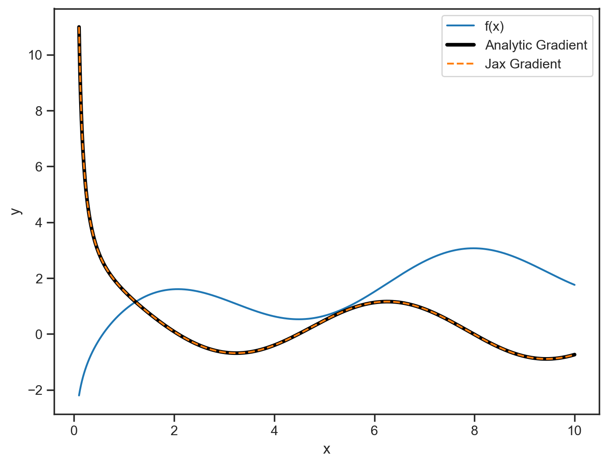
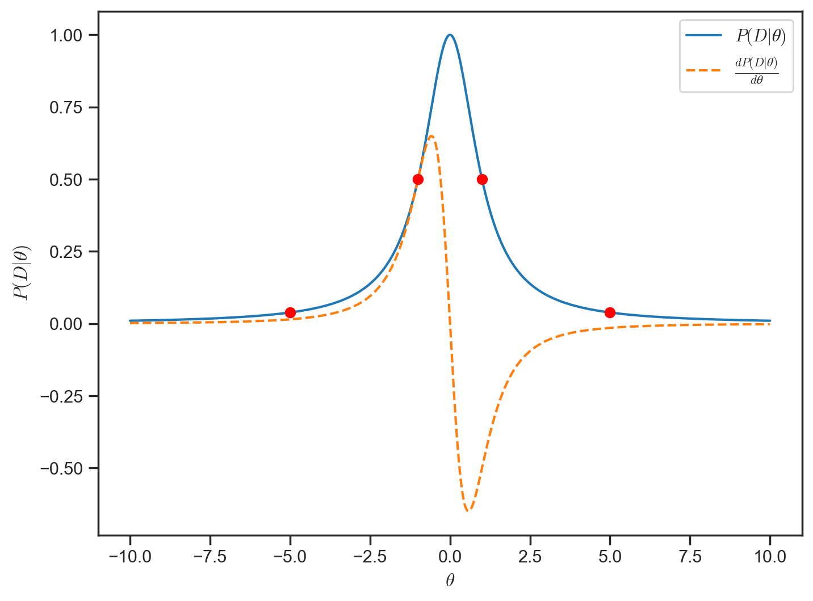
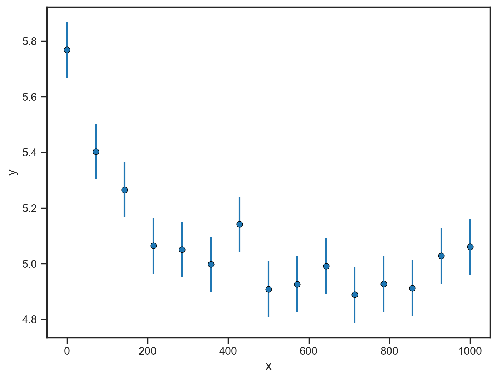
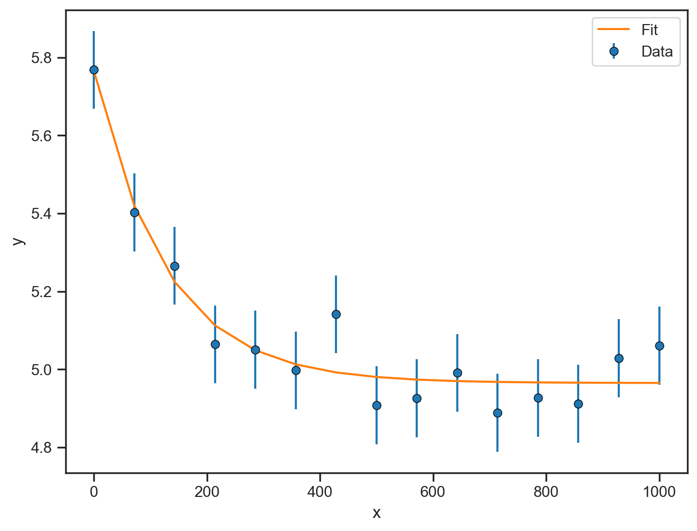
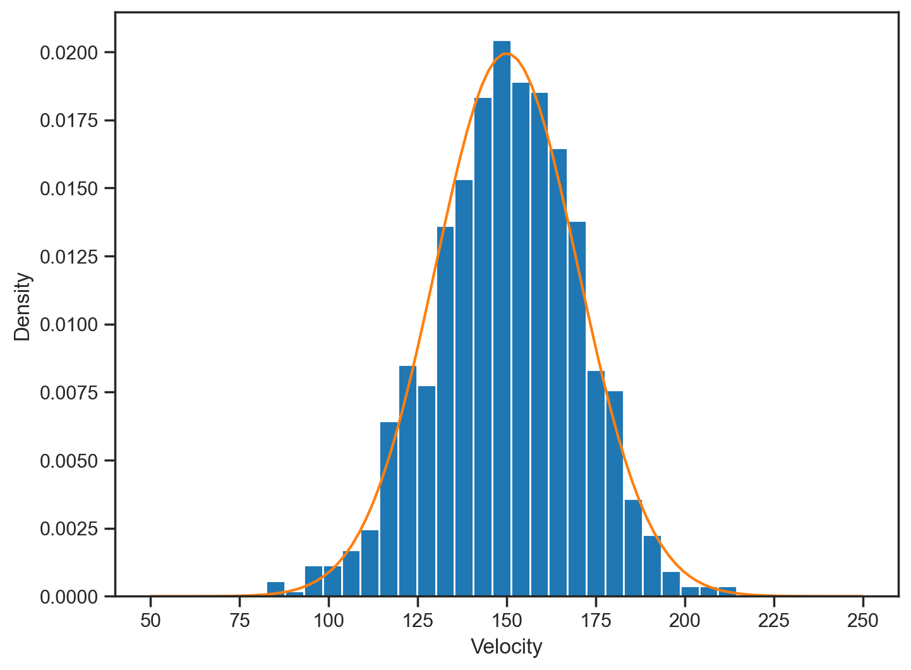
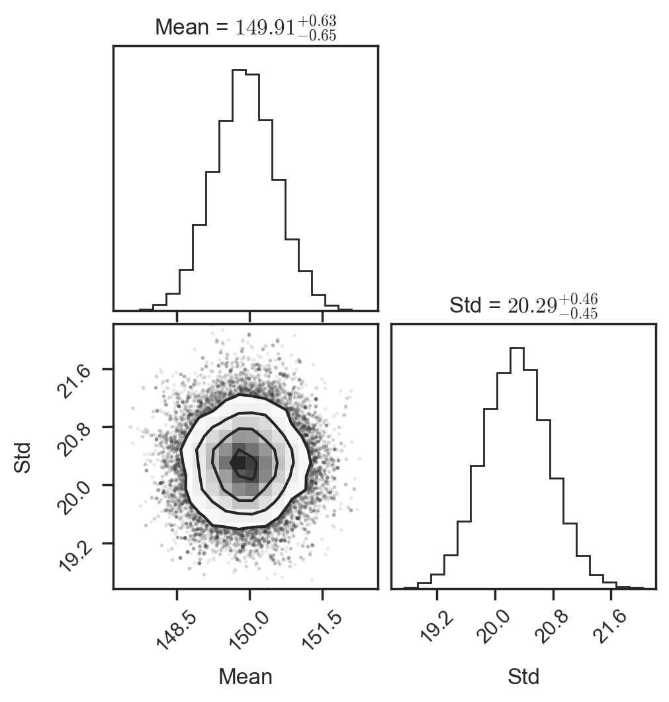

# A quick tour of JAX

This is a short demo of JAX that I put together for a group meeting.

```python
import numpy as np
import matplotlib.pyplot as plt

%config InlineBackend.figure_format = 'retina'
import seaborn as sns

sns.set_context("notebook")
sns.set_style("ticks")

import jax

# by default, jax uses 32-bit precision, which is a trade off that ML people are often willing to
# make, but for most of our purposes, we want 64-bit precision
jax.config.update("jax_enable_x64", True)
```

# Intro to JAX

`J` - JIT

`A` - Autograd

`X` - XLA

JAX is a python library that gives you three main things:
1. `JIT` - Just In Time compilation:
    - Speeds up your code
2. `Autograd` - Automatic differentiation:
    - Computes gradients of your code, with no extra effort on your part. Gradients can be useful on
      their own, but the real benefits come from including then in your optimization or fitting
      processes.
3. `XLA` - Accelerated Linear Algebra:
    - Compiles and runs code on CPU, GPUs or TPUs.


These things are all possible with languages like Julia or subsets of C++, but JAX is fully
integrated with Python and provides an _almost_ drop-in replacement for numpy.


Disclaimer 1: I'm not going to talk about GPU stuff here, if you have big problems _and_ access to
GPUs, you should look into it, expect orders of magnitude speedups just by switching from CPU to GPU
with essentially no code changes

Disclaimer 2: I'm not an expert on JAX, I just like to sprinkle it in my code when I can.
Documentation is linked at the end of this notebook and the JAX documentation is quite good and full
of examples.

### Three "magic" functions:

Most of the cool stuff in JAX comes from these three functions:

1. `jax.jit()` - Just In Time compilation

2. `jax.grad()` - Automatic differentiation

3. `jax.vmap()` - Automatic Vectorization

# JIT

Just In Time compilers compile code just before it is run. This can speed up your code
significantly, especially if you are running the same code many times.

Here is an example of how you can use JIT to speed up a simple function:

Functions need to be implemented in JAX in order to be JIT compiled. This means that you need to use
JAX's version of numpy functions, which are typically import as `jnp` (jax.numpy).


```python
# define some arbitrary function
def plummer_dispersion(rs, sigma0, a):
    return np.sqrt(sigma0**2 / np.sqrt(1 + rs**2 / a**2))


# define the same function but with jax
# import the jax version of numpy
import jax.numpy as jnp


# now define the function in the exact same way
def plummer_dispersion_jax(rs, sigma0, a):
    return jnp.sqrt(sigma0**2 / jnp.sqrt(1 + rs**2 / a**2))


# now do some basic benchmarking

# use an absurd resolution, for demonstration purposes
rs = np.linspace(0, 1000, 1_000_000)

# first the numpy version
print("numpy:")
%timeit plummer_dispersion(rs, 15, 200)
print()


# now the jax version
print("jax:")
%timeit plummer_dispersion_jax(rs, 15, 200)
print()

# now turn on JIT:
plummer_dispersion_jax_jit = jax.jit(plummer_dispersion_jax)

# The first time we evaluate the function, it will be compiled
print("jax jit compilation:")
%time _ = plummer_dispersion_jax_jit(rs, 15, 200)
print()

# all subsequent calls will be faster
print("jax jitted:")
%timeit plummer_dispersion_jax_jit(rs, 15, 200)

2.3e-3 / 350e-6

```

    numpy:
    2.28 ms ± 83.6 μs per loop (mean ± std. dev. of 7 runs, 100 loops each)
    
    jax:
    1.37 ms ± 17.1 μs per loop (mean ± std. dev. of 7 runs, 1,000 loops each)
    
    jax jit compilation:
    CPU times: user 11 ms, sys: 1.03 ms, total: 12 ms
    Wall time: 12.7 ms
    
    jax jitted:
    359 μs ± 10.5 μs per loop (mean ± std. dev. of 7 runs, 1,000 loops each)


    6.571428571428571


Let's look at what happened here. The plain numpy version runs pretty quickly, around 2ms per evaluation. The JAX numpy version runs about twice as fast. 

The really interesting stuff happens when we call the JIT'd version of the function. The first time we call it, it takes about 10ms, which is slower that the numpy version! This is because the JIT compiler is compiling the function. However, on all subsequent calls, the JIT'd version runs in about 350us, which is about 6 times faster than the numpy version.

Anything that is implemented in `numpy` can probably be implemented in JAX, though more complex functions may require more work. 

If you are doing a lot of "math stuff" in your code, you will probably be able to use JAX without too much trouble.

## Some things to be careful about: Control flow

JAX needs to be able to analyse ("trace" in JAX terminology) the code you want to JIT compile. This means that the behavior of your
code can't change depending on the input. Using IF statements or certain kinds of loops in your functions with cause problems
with JIT!

Here is a super simple function that contains an IF statement. The actual behavior of the function depends on the sign of the input.


```python
def function_with_if(x):
    if x > 0:
        return -x
    return x


print(function_with_if(5))
print(function_with_if(-5))
```

    -5
    -5


```python
# try to JIT this function

jax.jit(function_with_if)(5)

# fails with a big ugly error message
```


    ---------------------------------------------------------------------------

    TracerBoolConversionError                 Traceback (most recent call last)

    Cell In[4], line 3
          1 # try to JIT this function
    ----> 3 jax.jit(function_with_if)(5)
          5 # fails with a big ugly error message


        [... skipping hidden 11 frame]


    Cell In[3], line 2, in function_with_if(x)
          1 def function_with_if(x):
    ----> 2     if x > 0:
          3         return -x
          4     return x


        [... skipping hidden 1 frame]


    File /opt/miniconda3/envs/main/lib/python3.12/site-packages/jax/_src/core.py:1554, in concretization_function_error.<locals>.error(self, arg)
       1553 def error(self, arg):
    -> 1554   raise TracerBoolConversionError(arg)


    TracerBoolConversionError: Attempted boolean conversion of traced array with shape bool[].
    The error occurred while tracing the function function_with_if at /var/folders/ky/t4214cvn41x2pt7m57v3mlfrbv8h84/T/ipykernel_91983/1602498362.py:1 for jit. This concrete value was not available in Python because it depends on the value of the argument x.
    See https://jax.readthedocs.io/en/latest/errors.html#jax.errors.TracerBoolConversionError


When we try to JIT compile this function, we get an error. The error message is a bit of a mess, but it does tell us that JAX was unable to trace the function and points us to the line that caused the problem.

In most cases, there are ways to rewrite your code to avoid these issues. For example, you can use `jnp.where` instead of an IF statement.


```python
# can rewrite the same function to be more jax-friendly

def function_with_if_jax(x):
    return jnp.where(x > 0, -x, x)


print(function_with_if_jax(5))
print(jax.jit(function_with_if_jax)(-5))
```

    -5
    -5


This was a simple example of how to work around the restriction of control flow in JAX. There are more advanced ways to do this when you have a more complex function.

One common pattern is to specify "static arguments". Telling JAX that an argument is static means that the function will be recompiled if that argument changes.


```python
# static_argnums example


def add_loop(starting_val, increments):
    val = starting_val
    for _ in range(increments):
        val += 1
    return val


print(add_loop(5, 10))
```

    15


```python
# try to JIT this function

jax.jit(add_loop)(5, 10)

# fails with a big ugly error message, because the behavior of the function depends on the value of the second argument
```


    ---------------------------------------------------------------------------

    TracerIntegerConversionError              Traceback (most recent call last)

    Cell In[23], line 3
          1 # try to JIT this function
    ----> 3 jax.jit(add_loop)(5, 10)
          5 # fails with a big ugly error message, because the behavior of the function depends on the value of the second argument


        [... skipping hidden 11 frame]


    Cell In[22], line 6, in add_loop(starting_val, increments)
          4 def add_loop(starting_val, increments):
          5     val = starting_val
    ----> 6     for _ in range(increments):
          7         val += 1
          8     return val


        [... skipping hidden 1 frame]


    File /opt/miniconda3/envs/main/lib/python3.12/site-packages/jax/_src/core.py:1557, in concretization_function_error.<locals>.error(self, arg)
       1556 def error(self, arg):
    -> 1557   raise TracerIntegerConversionError(arg)


    TracerIntegerConversionError: The __index__() method was called on traced array with shape int64[]
    The error occurred while tracing the function add_loop at /var/folders/ky/t4214cvn41x2pt7m57v3mlfrbv8h84/T/ipykernel_91983/703288431.py:4 for jit. This concrete value was not available in Python because it depends on the value of the argument increments.
    See https://jax.readthedocs.io/en/latest/errors.html#jax.errors.TracerIntegerConversionError


```python
# try to JIT it again, this time specifying that the second argument is static

print(jax.jit(add_loop, static_argnums=(1))(5, 10))

# try with a different value of the second argument
print(jax.jit(add_loop, static_argnums=(1))(5, 100))
```

    15
    105


This sort of pattern is also extremely common for Class methods. In these cases you want to JAX that the `self` argument is static, so that the function is recompiled for each instance of the class.

It's very common to use the `@jax.jit` decorator to JIT functions at declaration time. In case you aren't familiar with decorators, decorators are a way to apply a function to another function at the time of declaration.


This is identical to using `f = jax.jit(f)`.

```python
import jax

def f(x):
    return x * 2

f_jit = jax.jit(f)

# equivalent to:

@jax.jit
def f(x):
    return x * 2

f(3) # this is JIT'd


# can also use @partial to JIT with some arguments static
from functools import partial

@partial(jax.jit, static_argnums=(1,))
def f(x, y):
    return x * y

f(3, 2) # this is JIT'd and specifies that the second argument is static
```

# VMAP

JAX also provides a way to automatically vectorize functions. This can be useful for executing the same function on many different inputs _in parallel_. VMAP is subject to most of the same restrictions as JIT, but can get you similar speedups.


```python
# Let's create a function that calculates multiple statistical properties at once
def compute_stats(x):
    # Calculate mean, standard deviation, and skewness for a single array
    mean = jnp.mean(x)
    std = jnp.std(x)
    return mean, std

# Create some test data - 50 arrays of 1000 samples each
data = jnp.array([np.random.normal(loc=i, scale=1.0, size=1000) for i in range(50)])


# Without vmap - looping over the data
print("Without vmap:")
%timeit regular_stats = jnp.array([compute_stats(x) for x in data])

# With vmap - Executes the function in parallel, all at once
print("\nWith vmap:")
vectorized_stats = jax.vmap(compute_stats)
%timeit vmap_stats = vectorized_stats(data)

```

    Without vmap:
    6.09 ms ± 85 μs per loop (mean ± std. dev. of 7 runs, 100 loops each)
    
    With vmap:
    212 μs ± 14 μs per loop (mean ± std. dev. of 7 runs, 1,000 loops each)


This is a bit of a contrived example, because you could have specified the indices in the original function and evaluated everything at the same time. This kind of manual broadcasting/indexing can be a bit error-prone and hard to read, so VMAP can be a useful tool for this kind of thing.

If you are using functions that don't support this kind of broadcasting, VMAP can be a very useful tool. This situaton comes up more often that you might think. Evaluating some custom PDF on a large multidimensional grid might be a good example of this.


# Autograd

Autograd is a way to automatically compute gradients of your code. This is useful for optimization, fitting, and many other things.

Autograd is not exactly symbolic differentiation. It is a repeated application of the chain rule. Despite not being symbolic, it will still calculate gradients that are correct to machine precision because the analytic derivatives of the base functions are known.

Here is an example of how to use autograd to compute the gradient of a simple function:


```python
# some functions to differentiate
def function_to_diff(x):
    return jnp.sin(x) + jnp.log(x)

# the analytical derivative of the function
def analytical_derivative(x):
    return jnp.cos(x) + 1 / x


# Compute the gradient of the function using jax
grad_fn = jax.grad(function_to_diff)

xs = np.linspace(0.1, 10, 1_000)

plt.figure()


plt.plot(xs, function_to_diff(xs), label="f(x)")

plt.plot(xs, analytical_derivative(xs), label="Analytic Gradient", lw=3, color="black")

# here we use vmap to apply the gradient function to all the values in xs, grad only works on scalar
# functions (intended for things like loss functions), but see jax.jacobian for vector functions
plt.plot(xs, jax.vmap(grad_fn)(xs), label="Jax Gradient", ls="--")
plt.xlabel("x")
plt.ylabel("y")
plt.legend()
```


    <matplotlib.legend.Legend at 0x14fb2b6b0>


    

    


In this simple example, we were able to analytically compute the gradient of the function, so we could verify that the autograd result was correct. In practice, you will often be using autograd to compute gradients of functions that you can't easily differentiate by hand.

Note that `jax.grad()` is specifically for scalar functions. If you have a vector function, you can use `jax.jacobian()` to compute the Jacobian matrix, which gives you the gradient of the function with respect to each element of the input vector.

Let's try a slightly more complicated example, this time with some control flow. We can use `jax.grad()` to compute the gradient of this function, even though it contains an IF statement.

In this case, the function is still simple enough that we could have compute some piecewise gradient by hand, but this is a time consuming and error-prone process. Autograd can handle this kind of thing with no extra effort on your part.


```python
def difficult_function(x, y):
    # some awkward function **with control flow**
    if 5 < x < 10:
        return x**2 + y**2
    elif x < 5:
        return jnp.sin(x) + jnp.log(y)
    else:
        return jnp.sqrt(x) + jnp.exp(y)


# We can't JIT this function as it is, but we can Differentiate it!

grad_difficult_function = jax.grad(difficult_function)

xs = np.linspace(0, 15, 100)
y = 3.0

plt.figure()
plt.plot(xs, [difficult_function(x, y) for x in xs], label=f"f(x, y={y})")
plt.plot(xs, [grad_difficult_function(x, y) for x in xs], label="df/dx", ls="--")

plt.xlabel("x")
plt.ylabel("z")
plt.legend()
```


    <matplotlib.legend.Legend at 0x159bfddc0>


    

    


# Combining JIT and Autograd: some more practical examples

These examples have all been a bit contrived, let set up an example that is a bit more realistic. Calculating the gradient of a loss function to speed up optimization.

## A reminder of why gradients are useful for optimization problems

First it's worth quickly looking at why gradients are useful for optimization-style problems. 

In the figure below, I've created a toy likelihood function for easy visualization. This likelihood is symmetric, but also fairly sharpely peaked.

I've drawn four different points on this likelihood and we can look at each of them to see how the gradient can help us find the minimum:
- At the leftmost point, the gradient is positive, but small, so the optimal step would be a large positive step. 

- At the second point, the gradient is still positive, but larger, so the optimal step would be a small positive step. 

- At the third point, we now have a large negative gradient, so the optimal step would be a small negative step. 

- At the rightmost point, the gradient is negative, but small, so the optimal step would be a large negative step. 

This is the basic idea behind gradient descent. The sign of the gradient tells you which way to go, and the magnitude of the gradient tells you how far to go.


```python
# draw a laurentian profile as an example likelihood function
def lorentzian(x, x0, gamma):
    return 1 / (1 + ((x - x0) / gamma)**2)

lorentzian_grad = jax.grad(lorentzian)

plt.figure()
x = np.linspace(-10, 10, 1000)
plt.plot(x, lorentzian(x, 0, 1), label=r"$P(D|θ)$")
plt.plot(x, [lorentzian_grad(x, 0, 1) for x in x], ls="--", label=r"$\frac{dP(D|θ)}{dθ}$")
plt.xlabel(r"$\theta$")
plt.ylabel(r"$P(D|θ)$")
plt.legend()

# add in some larger dots at the values of -5, -1, 1, and 5
plt.scatter([-5, -1, 1, 5], lorentzian(np.array([-5, -1, 1, 5]), 0, 1), color="red", zorder=10)

```


    <matplotlib.collections.PathCollection at 0x16858be00>


    

    


```python

```

## Now apply this to a real optimization problem

Here we'll apply this to a simple optimization problem. We'll start by defining some simple function that we want to fit and then compare the runtimes of a few different setups.


```python
# set up the problem

xs = np.linspace(0.0, 1000.0, 15)


# function with some parameters, exponential decay with an offset
def exponential_decay(x, a, b, c):
    return a * jnp.exp(-x / b) + c


params = (1.0, 100.0, 5)

# generate some data
ys = exponential_decay(xs, *params)

# add some noise, here we assume the noise is known (and in this case, constant)
ys += 0.1 * np.random.randn(len(xs))

yerrs = np.ones_like(ys) * 0.1

plt.figure()
plt.errorbar(xs, ys, yerr=0.1, fmt="o", label="Data")
plt.xlabel("x")
plt.ylabel("y")
```


    Text(0, 0.5, 'y')


    

    


```python
# set up the loss function


def nll(params, xs, ys, yerrs):
    model_ys = exponential_decay(xs, *params)
    return jnp.sum(0.5 * ((model_ys - ys) / yerrs) ** 2)


# optimize the function
from scipy.optimize import minimize

result = minimize(
    lambda params: nll(params, xs, ys, yerrs),
    x0=(5.0, 200.0, 10.0),
    tol=1e-10,
)

plt.figure()
plt.errorbar(xs, ys, yerr=0.1, fmt="o", label="Data")
plt.plot(xs, exponential_decay(xs, *result.x), label="Fit")
plt.xlabel("x")
plt.ylabel("y")
plt.legend()


print(f"True params: {params}")
print(f"Fit params: {result.x}")
print(f"Number of function evaluations: {result.nfev}")
```

    True params: (1.0, 100.0, 5)
    Fit params: [  0.79996054 126.78013037   4.96478293]
    Number of function evaluations: 280


    

    


```python
# benchmark the plain nll vs a jitted version

print("nll:")
%timeit minimize(lambda params: nll(params, xs, ys, yerrs), x0=(5.0, 200.0, 10.0), tol=1e-10)

nll_jax = jax.jit(nll)
_ = nll_jax((5.0, 200.0, 10.0), xs, ys, yerrs)

print("nll JIT:")
%timeit minimize(lambda params: nll_jax(params, xs, ys, yerrs), x0=(5.0, 200.0, 10.0), tol=1e-10)
```

    nll:
    25.7 ms ± 1.12 ms per loop (mean ± std. dev. of 7 runs, 10 loops each)
    nll JIT:
    12.2 ms ± 117 μs per loop (mean ± std. dev. of 7 runs, 100 loops each)


As we've seen before, for simple functions like this, we get about a 2x speedup from JIT. 


```python
# now we try the same thing, but we include the gradient

jac = jax.jacobian(nll)

result = minimize(
    lambda params: nll(params, xs, ys, yerrs),
    x0=(5.0, 200.0, 10.0),
    tol=1e-10,
    jac=lambda params: jac(params, xs, ys, yerrs),
)

print(f"True params: {params}")
print(f"Fit params: {result.x}")
print(f"Number of function evaluations: {result.nfev}")
print(f"Number of gradient evaluations: {result.njev}")

```

    True params: (1.0, 100.0, 5)
    Fit params: [  0.79996104 126.77947087   4.96478334]
    Number of function evaluations: 32
    Number of gradient evaluations: 32


By using the gradient of the loss function, we arrive at the same answer but with many fewer function evaluations.

This can really add up if your model is slow to evaluate, or if this optimization step happens as a part of a larger iterative process.


```python
# benchmark the plain nll vs a gradient version

print("nll:")
%timeit minimize(lambda params: nll(params, xs, ys, yerrs), x0=(5.0, 200.0, 10.0), tol=1e-10)

nll_jax = jax.jit(nll)
jac_jax = jax.jit(jac)

_ = nll_jax((5.0, 200.0, 10.0), xs, ys, yerrs)

print("nll Gradient:")
%timeit minimize(lambda params: nll_jax(params, xs, ys, yerrs), x0=(5.0, 200.0, 10.0), tol=1e-10)
```

    nll:
    25.9 ms ± 941 μs per loop (mean ± std. dev. of 7 runs, 10 loops each)
    nll Gradient:
    12.6 ms ± 189 μs per loop (mean ± std. dev. of 7 runs, 100 loops each)


Here we get a similar speedup from using the gradient as we did from JIT.

This is a very simple model though, and if our function evaluations were more expensive, the speedup from using the gradient would be even more pronounced.

# Another practical example: fitting a velocity dispersion with MCMC

Here we'll finally look at an almost real-world example, fitting a velocity dispersion with MCMC.


MCMC requires a ton of likelihood evaluations and is an ideal demonstration of the speedups you can get with JAX. If we can speed up the likelihood evaluation, we can speed up the MCMC.

Here we will just just `emcee` which doesn't use gradient information but we could use something much fancier! I like to use the `blackjax` library for this sort of thing which provides HMC and NUTS samplers along with automated tuning of the sampler parameters.


```python
import scipy
from astropy.stats import knuth_bin_width
```

Start by setting up the data for this problem.

Here we just sample from a gaussian with a mean of 150 and a dispersion of 20. We then add some noise to the data.


```python
# set up the data for this example


vels = scipy.stats.norm.rvs(loc=150, scale=20, size=1000)

# add some noise, roughly 1 km/s, but not the same for all stars

dvels = scipy.stats.norm.rvs(loc=0, scale=1, size=1000)


vels += dvels

plt.figure()
_, bin_edges = knuth_bin_width(vels, return_bins=True)
plt.hist(vels, bins=bin_edges, density=True)
plt.xlabel("Velocity")
plt.ylabel("Density")

# plot the true distribution
plt.plot(
    np.linspace(50, 250, 100),
    scipy.stats.norm.pdf(np.linspace(50, 250, 100), loc=150, scale=20),
    label="True Distribution",
)
```


    [<matplotlib.lines.Line2D at 0x33d75c290>]


    

    


Now we just need to define our likelihood, prior and posterior functions. This is all the same as you would do in a normal MCMC, but we'll use the JAX versions of the numpy functions.


```python
# goal for this example is to fit a Gaussian to the data, accounting for the errors

# so we have just 2 parameters: the mean, the standard deviation


def log_likelihood(params, vels, dvels):
    mean, std = params

    # compute the likelihood of each star
    log_likelihoods = jax.scipy.stats.norm.logpdf(vels, loc=mean, scale=jnp.sqrt(std**2 + dvels**2))

    # return the sum of the likelihoods
    return jnp.sum(log_likelihoods)


def log_prior(params):
    mean, std = params

    return jnp.sum(jax.scipy.stats.uniform.logpdf(
        loc=jnp.array([0, 0]),
        scale=jnp.array([200, 100]),
        x=jnp.array([mean, std]),
    ))

def log_posterior(params, vels, dvels):
    return log_likelihood(params, vels, dvels) + log_prior(params)


```

Now we set up emcee. Here I'm using a massively overkill number of walkers and steps, but this is just to demonstrate the speedup you can get with JAX.


```python
# now set up emcee
import emcee

ndim, nwalkers = 2, 100
pos0 = [130, 10] + 1e-1 * np.random.randn(nwalkers, ndim)

sampler = emcee.EnsembleSampler(nwalkers, ndim, log_posterior, args=(vels,dvels))
_ = sampler.run_mcmc(pos0, 1000, progress=True)

```

    100%|██████████| 1000/1000 [00:39<00:00, 25.28it/s]


Around 40 seconds for the plain un-JIT'd version. This is by no means slow, but we can do better. If you need to compute dispersions for a ton of bins, or if you're running MCMC as one part of a larger iterative process, this can really add up.


```python
# plot the chains
flat_chain = sampler.get_chain(flat=True, discard=500)

from corner import corner

_ = corner(flat_chain, labels=["Mean", "Std", "Scatter"], show_titles=True)
```


    

    


And we do in fact recover the true value of the velocity dispersion.

Now we'll JIT the likelihood function. This is super simple and requires no changes to the code.


```python
# let's try to JIT the log_likelihood function

log_posterior_jax = jax.jit(log_posterior)

# now set up emcee
sampler = emcee.EnsembleSampler(nwalkers, ndim, log_posterior_jax, args=(vels,dvels))
_ = sampler.run_mcmc(pos0, 1000, progress=True)

```

    100%|██████████| 1000/1000 [00:02<00:00, 448.61it/s]


And with that simple change, we get a 20x speedup. With no additional complexity or changes to the code.


```python
flat_chain = sampler.get_chain(flat=True, discard=500)

_ = corner(flat_chain, labels=["Mean", "Std", "Scatter"], show_titles=True)
```


    

    


And we do still get the right answer.

# Awkward things that I've hidden from you

Some things that I've hidden in these examples:

- JAX is designed to be functional. This manifests in a few ways, but here are two that you're
  likely to run into:

    1. JAX functions are usually "pure" functions. This means that they don't modify any state
       outside of the function. JAX functions will typically return a copy of the input data rather
       than modifying the input data in place. (You can't reliably print from a JIT'd function, or
       access global variables, for example.)
    
    2. JAX arrays are immutable. You can't directly modify the values of a JAX array. There is
       however syntactic sugar for updating values in a JAX array, but in non-JIT'd code this is
       just creating a new array with the updated values.

- We already talked about control flow, which is the thing that requires the most thought when
  converting code to JAX. There is basically always a way to do what you want, but depending on the
  complexity of the function, it can be a bit of a pain.

- In JIT'd code, array shapes must be known and static. This means that you can't use JIT with
  functions that have variable shape inputs or outputs. Usually this is not a problem, but you might
  need to think about the shapes of your arrays and especially what happens when things go wrong
  than you would with numpy. No returning zero-dim arrays on errors, no growing arrays to store
  results, etc.

- JAX can only compute gradients of functions defined in JAX. If you have legacy code that you want
  to use that calls C or Fortran functions, you cannot use JAX to compute gradients of that code. If
  you can (somehow?) compute the derivative of this function then you can still integrate this
  function into your JAX code, but you will have to provide the derivative yourself, and this is not
  a common occurrence.


```python
arr = jnp.array([1, 2, 3, 4, 5])

# try to update the 3rd element
arr[3] = 10
```


    ---------------------------------------------------------------------------

    TypeError                                 Traceback (most recent call last)

    Cell In[26], line 4
          1 arr = jnp.array([1, 2, 3, 4, 5])
          3 # try to update the 3rd element
    ----> 4 arr[3] = 10


    File /opt/miniconda3/envs/main/lib/python3.12/site-packages/jax/_src/numpy/array_methods.py:586, in _unimplemented_setitem(self, i, x)
        582 def _unimplemented_setitem(self, i, x):
        583   msg = ("JAX arrays are immutable and do not support in-place item assignment."
        584          " Instead of x[idx] = y, use x = x.at[idx].set(y) or another .at[] method:"
        585          " https://jax.readthedocs.io/en/latest/_autosummary/jax.numpy.ndarray.at.html")
    --> 586   raise TypeError(msg.format(type(self)))


    TypeError: JAX arrays are immutable and do not support in-place item assignment. Instead of x[idx] = y, use x = x.at[idx].set(y) or another .at[] method: https://jax.readthedocs.io/en/latest/_autosummary/jax.numpy.ndarray.at.html


```python
# syntactic sugar for updating an array
arr.at[3].set(10)

```


    Array([ 1,  2,  3, 10,  5], dtype=int64)


```python
# remember that jax arrays are immutable and functions are pure, so we need to reassign the result
arr
```


    Array([1, 2, 3, 4, 5], dtype=int64)


```python
# this is how you would do an in-place update in practice
arr = arr.at[3].set(10)
arr
```


    Array([ 1,  2,  3, 10,  5], dtype=int64)


```python
# some other .at methods
print(arr.at[3].add(5))
print(arr.at[3].mul(2))
print(arr.at[3].max(3))
print(arr.at[3].min(3))
```

    [ 1  2  3 15  5]
    [ 1  2  3 20  5]
    [ 1  2  3 10  5]
    [1 2 3 3 5]


You might be wondering: aren't these copies slower than in-place updates? Yes, they are, but when you JIT a function, these actually get compiled into fast in-place updates. This takes a bit of getting used to, but is typically not a problem in practice.

# Some useful links:

## JAX documentation

- [Installation instructions](https://jax.readthedocs.io/en/latest/installation.html)

- [Quickstart](https://jax.readthedocs.io/en/latest/quickstart.html)

- [Gotchas](https://jax.readthedocs.io/en/latest/notebooks/Common_Gotchas_in_JAX.html): Common pitfalls when using JAX.

- [Thinking in JAX](https://jax.readthedocs.io/en/latest/notebooks/thinking_in_jax.html)

## Libraries

- [jaxopt](https://jaxopt.github.io/stable/): Optimization routines in JAX. Automatically uses gradient information to speed up optimization.

- [diffrax](https://docs.kidger.site/diffrax/): Differential equation solvers in JAX. Fast, fully compatible with JAX.

- [optax](https://optax.readthedocs.io/en/latest/): Gradient-Descent style optimizers in JAX. Provides a ton of different optimizers and utilities for optimization tasks.

- [lineax](https://docs.kidger.site/lineax/): Linear algebra solvers in JAX. Fast, supports rectangular matrices, and fully compatible with JAX.

- [optimistix](https://docs.kidger.site/optimistix/): Nonlinear optimization in JAX. Root finding, differential equation solvers, least squares, and more.

- [blackjax](https://github.com/blackjax-devs/blackjax): HMC and NUTS samplers in JAX. Uses JIT and autograd to massively speed up MCMC tasks.

- [numpyro](https://num.pyro.ai/en/stable/): Probabilistic programming in JAX. Similar to PyMC or Stan.

- [tinygp](https://tinygp.readthedocs.io/en/stable/): Gaussian processes in JAX.

- [bayeux](https://jax-ml.github.io/bayeux/): General purpose Bayesian inference in JAX. Provide a JAX-compatible log likelihood function and apply your choice of inference methods, common interface to a variety of MCMC methods, optimizers and variational inference.

- [equinox](https://docs.kidger.site/equinox/): Neural Networks in JAX. Fast, simple, and flexible. Also provides a ton of useful utilities for building and debugging more complicated non-neural network models in JAX. 

- [jaxtyping](https://github.com/patrick-kidger/jaxtyping): Library for type _and array shape_ checking in JAX.

## Astronomy specific stuff

- [galax](https://github.com/GalacticDynamics/galax/): JAX-based successor to Gala. Still in development, but already usable for many tasks.

- [coordinax](https://github.com/GalacticDynamics/coordinax/): Astropy coordinates in JAX.

- [unxt](https://github.com/GalacticDynamics/unxt/): Astropy units in JAX.
